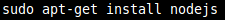
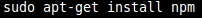
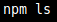
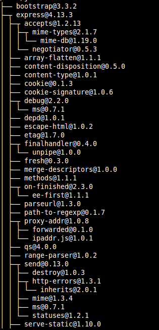
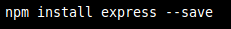
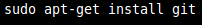
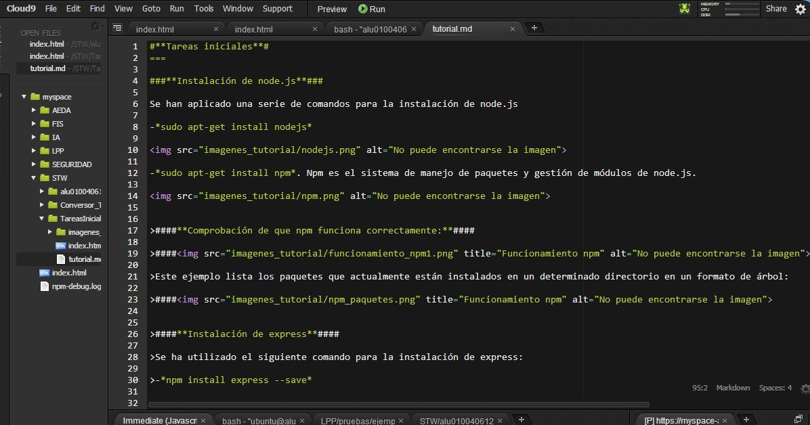
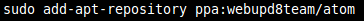
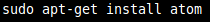

#**Tareas iniciales**#
===

###**Instalación de node.js**###

Se han aplicado una serie de comandos para la instalación de node.js

-*sudo apt-get install nodejs*

-*sudo apt-get install npm*. Npm es el sistema de manejo de paquetes y gestión de módulos de node.js.

>####**Comprobación de que npm funciona correctamente:**####

>####

>Este ejemplo lista los paquetes que actualmente están instalados en un determinado directorio en un formato de árbol:

>####

>####**Instalación de express**####

>Se ha utilizado el siguiente comando para la instalación de express:

>-*npm install express --save*

>####

###**Instalación de git**###

Para la instalación de git se han utilizado los siguientes comandos:

-*sudo apt-get install git*

###**Cloud 9**###

Cloud9 combina un potente editor de código online con un completo espacio de trabajo de Ubuntu en la nube. Soporta más de 40 lenguajes y es sencillo de manejar.

###**Instalacion de Atom**###

Se ha hecho uso del siguiente comando para la instalación de Atom:

-*sudo add-apt-repository ppa:webupd8team/atom*.
La instalación es necesario realizarla mediante un PPA de webupd8team.

Una vez actualizados los paquetes de Ubuntu para que éste reconozca aquellos que se hayan incorporado recientemente, ejecutamos el siguiente comando en la consola:

-*sudo apt-get install atom*.

###**Markdown**###

>####**Sintaxis:**####

>####*Encabezados:*#####
># H1
>## H2
>### H3
>#### H4
>##### H5
>###### H6

>####*Tipografía:*####
> **Negrita**
> *Cursiva*
> > Citas
> ~~Scratch~~

>####*Referencias a links:*####
> * [Links](https://example.com)

>####*Listas:*####
> 1. Lista 1
> 2. Lista 2
> * Lista 1
> * Lista 2

>####*Imágenes:*####
> ![alt text][logo]
> 

>####*Líneas horizontales:*####
>---
>***
>___

>####*Tablas:*####
>| Tables        | Are           | Cool  |
>| ------------- |:-------------:| -----:|
>| col 3 is      | right-aligned | $1600 |

###**Referencias utilizadas**###

Node js
* [Links](https://nodejs.org/en/)

Atom
* [Links](https://atom.io/)

Pandoc
* [Links](http://pandoc.org/)

GitHub Pages
* [Links](https://pages.github.com/)

Markdown
* [Links]()

Cloud 9
* [Links](https://c9.io/)
