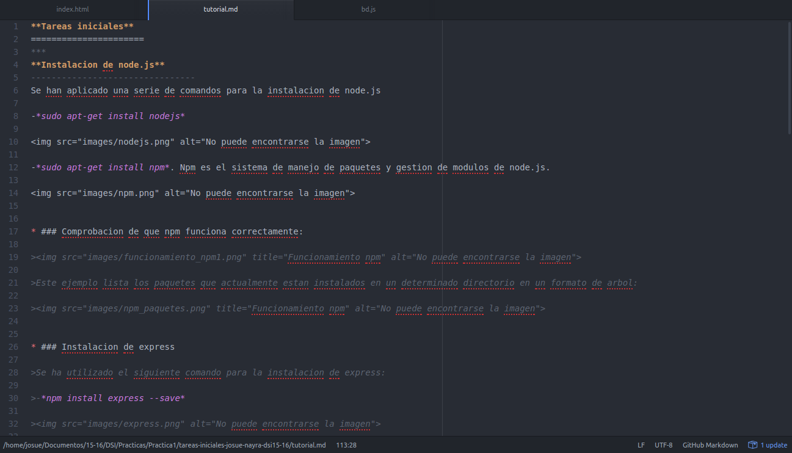
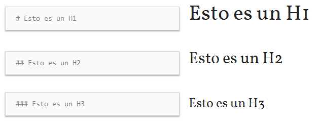
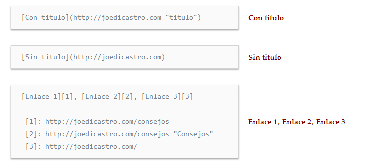
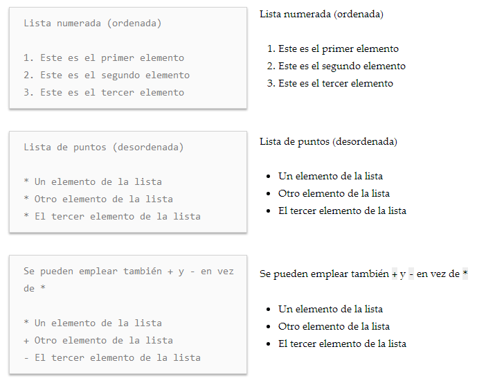
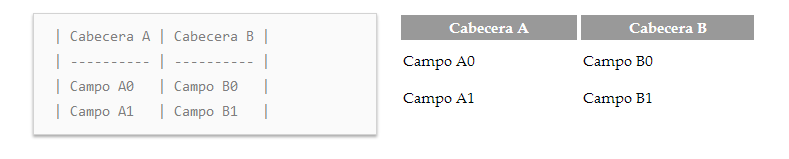

**Tareas iniciales**
======================
***
**Instalacion de node.js**
--------------------------------
Se han aplicado una serie de comandos para la instalacion de node.js

-*sudo apt-get install nodejs*

>>

-*sudo apt-get install npm*. Npm es el sistema de manejo de paquetes y gestion de modulos de node.js.

>>

* ### Comprobacion de que npm funciona correctamente:

>>

>Este ejemplo lista los paquetes que actualmente estan instalados en un determinado directorio en un formato de arbol:

>>

* ### Instalacion de express

>Se ha utilizado el siguiente comando para la instalacion de express:

>-*npm install express --save*

>>

**Instalacion de git**
----------------------------
Para la instalacion de git se han utilizado los siguientes comandos:

-*sudo apt-get install git*

>>

**Cloud 9**
-----------------
Cloud9 combina un potente editor de codigo online con un completo espacio de trabajo de Ubuntu en la nube. Soporta mas de 40 lenguajes y es sencillo de manejar.

>>

**Instalacion de Atom**
-----------------------------
Se ha hecho uso del siguiente comando para la instalacion de Atom:

-*sudo add-apt-repository ppa:webupd8team/atom*.
La instalacion es necesario realizarla mediante un PPA de webupd8team.

>>

Una vez actualizados los paquetes de Ubuntu para que este reconozca aquellos que se hayan incorporado recientemente, ejecutamos el siguiente comando en la consola:

-*sudo apt-get install atom*.

>>

>>

**Markdown**
------------------
>**Sintaxis:**

>* *Encabezados:*

>>

>* *Tipografia:*

>>

>* *Enlaces:*

>>

>* *Listas:*

>>

>* *Imagenes:*

>>

>* *Tablas:*

>>

**Referencias utilizadas**
--------------------------------

* [Node js](https://nodejs.org/en/)

* [Atom](https://atom.io/)

* [Pandoc](http://pandoc.org/)

* [GitHub Pages](https://pages.github.com/)

* [Markdown](https://joedicastro.com/pages/markdown.html)

* [Cloud 9](https://c9.io/)
